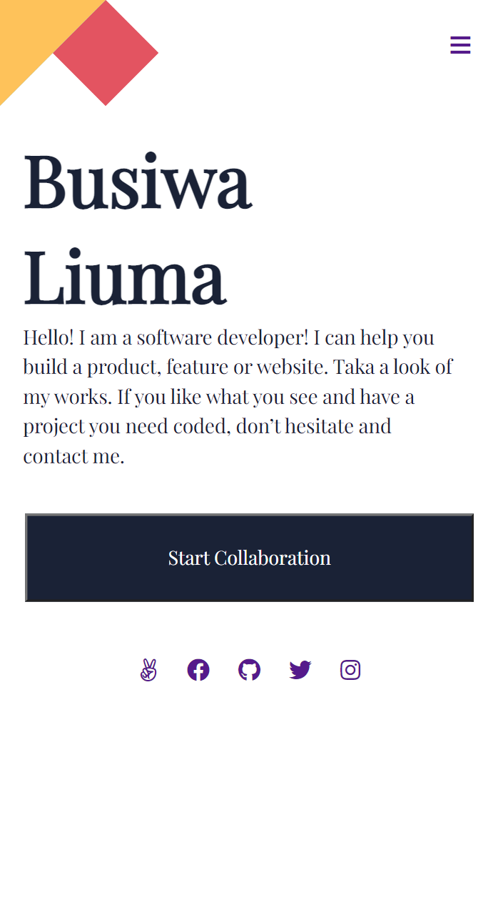

# M

> One paragraph statement about the project.

Additional description about the project and its features.

## Built With

- HTML
- CSS

## Live Demo

[Live Demo Link](https://busiwa24.github.io/My-Mobile-Portfolio/))

## Getting Started

**This is an example of how you may give instructions on setting up your project locally.**
**Modify this file to match your project, remove sections that don't apply. For example: delete the testing section if the currect project doesn't require testing.**

To get a local copy up and running follow these simple example steps.

### Prerequisites

-You only need a web browser on your local machine

## Authors

👤 **Busiwa Liuma**

- GitHub: [@githubhandle](https://github.com/Busiwa24)
- Twitter: [@twitterhandle](https://twitter.com/@busiwaliuma)
- LinkedIn: [LinkedIn](https://linkedin.com/in/busiwa-liuma-28385b80/)

## Show your support

Give a ⭐️ if you like this project!

## Acknowledgments

- Hats off to Munsa Mibenge
- Inspiration
- etc

## 📝 License

This project is [MIT](./MIT.md) licensed.
