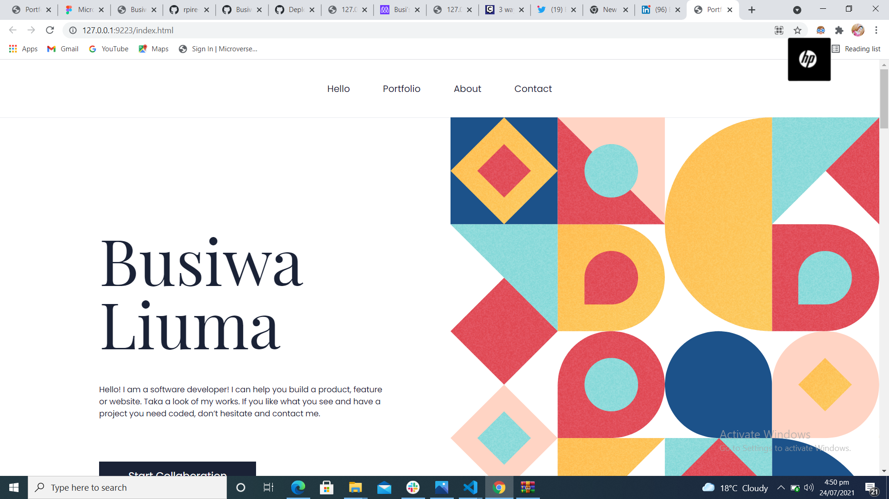

# Microverse Portfolio Webpage

> This project is a desktop and mobile version of a portfolio website..

## Built With

- HTML5 & CSS3

## Live Demo

[Live Demo Link](https://busiwa24.github.io/Test-Portfolio/)

## Getting Started

To get a local copy up and running follow these simple example steps.

### Get the repository into your PC.
- Clone this repository using this URL [https://rpire.github.io/microverse-portfolio.git](https://rpire.github.io/microverse-portfolio.git) or download it as a ZIP from the "Code" tab and extract the files.

### Usage
- To use it open the "index.html" file in your local copy of the repository after cloning or downloading.

## Author

👤 **Busiwa Liuma.**

- GitHub: (https://github.com/Busiwa24)
- Twitter: (https://twitter.com/busiwaliuma)
- LinkedIn: (https://www.linkedin.com/in/busiwa-liuma-28385b80/)

## Show your support

Give a ⭐️ if you like this project!

